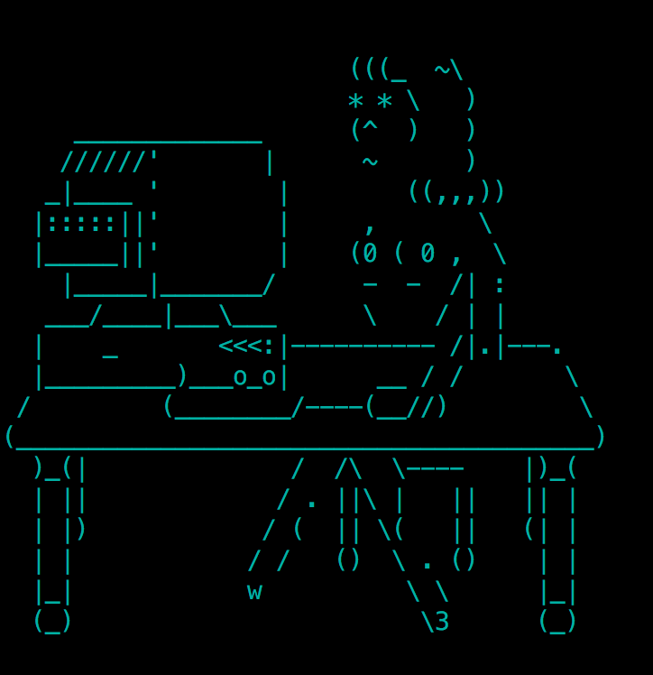

glu-zsh
============================

a startup ascii [`oh-my-zsh`](https://github.com/robbyrussell/oh-my-zsh) plugin for *girls like us



How to install
--------------

To install `glu-zsh` under `oh-my-zsh`:

Step 1: Clone this repository in `oh-my-zsh`'s plugins directory:

```bash
git clone git@github.com:ryeskelton/glu-zsh.git ~/.oh-my-zsh/custom/plugins/glu-zsh
```

Step 2: Activate the plugin in `~/.zshrc`:

```bash
plugins=([plugins...], glu-zsh)
